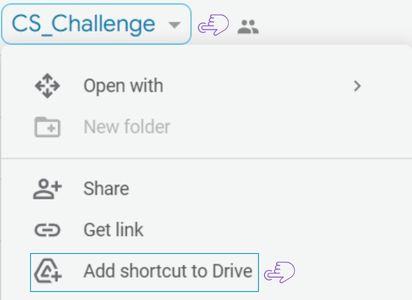
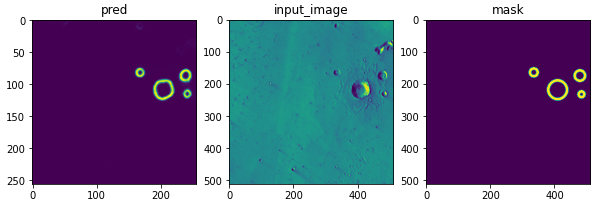
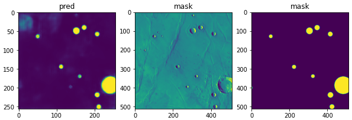
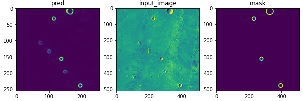
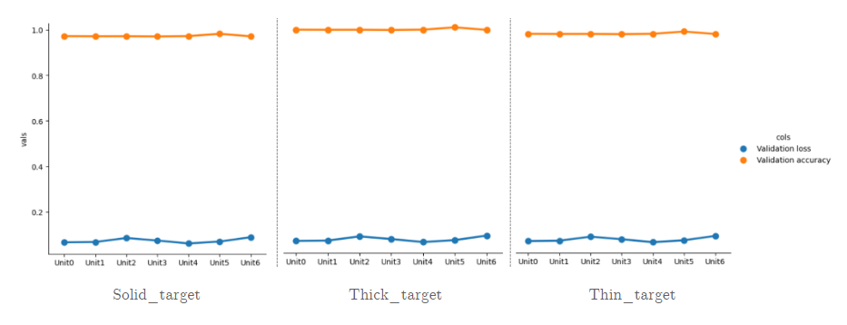

# Segmentation Convolutional Neural Networks for Automatic Crater Detection on Mars [TSYP CS Challenge 2022]
# Preparation
To begin, you will need to clone this GitHub repository :
```bash 
git clone https://github.com/Soulaimene/CS_Challenge_2022.git

```
To obtain the data, you will need to access the [Dhouib-Akram's drive](https://drive.google.com/drive/folders/1W23o71RVu513O8AT20DxYGukyeAhguD6?usp=sharing) we have created. In this drive, you will find a zipped dataset called "Input_data.zip." Download this file and unzip it in the cloned folder.

Before training, if you want to use the dataset to train a model for semantic segmentation of filled data, you will need to : 
* Access the "filled" folder in the drive and download the zipped dataset "output filled data." 
* Unzip the downloaded dataset and save it in the cloned folder. 

Similarly, if you want the thick or thin versions, you will need to access the respective folders called "thin" or "thick" and download the corresponding zipped datasets.
# How to train
## Train on your local computer
```bash 
python main.py --n_epoch 50 --n_bs 32  --n_unet 0
```
> Note : If you did not save the datasets in the cloned folder, you will need to specify the path to your input data and masks data, as well as the path to all other relevant data.
```bash 
python main.py --n_epoch 50 --n_bs 32  --n_unet 0 --Input_p "/Input_data_path/" --mask_p "/mask_data_path/"
```
You need to ensure that you have a compatible version of TensorFlow installed, as well as the appropriate versions of CUDA and cuDNN. These tools allow TensorFlow to use the GPU for acceleration, which can significantly improve the performance of machine learning tasks. 
## Remote training

If your local computer does not have the required versions of TensorFlow, CUDA, and cuDNN installed, you can still train any of the 7 UNET models by accessing the specified [drive](https://drive.google.com/drive/folders/1W23o71RVu513O8AT20DxYGukyeAhguD6?usp=share_link).

<table>
  <tr>
    <td valign="top"> </td>
    <td valign="top"><p><br/>To create a shortcut to the CS_challenge drive, right-click on the drive and select "Add shortcut to Drive." Then, 
    move the shortcut to your own drive.
    To run Google Colaboratory notebooks, you need to access the data from your own drive rather than shared drives. Therefore, we create the shortcut</p> </td>
  </tr>
</table>

The drive contains the necessary resources and tools for training the models. For example, inside the [Filled folder](https://drive.google.com/drive/folders/1W23o71RVu513O8AT20DxYGukyeAhguD6?usp=sharing), 

within the [unet1()](https://drive.google.com/drive/folders/12WbBJm1f62Z40l8QBV9mZRXNbk68IZcR?usp=sharing), 
you will find the notebook (".ipynb" file) for training the model.

# Results 
You can refer to this table for some of our top predictions made using various  Crater U-Net models.
<table>
  <tr>
    <td valign="top">  circle with a thick edge </td>
    <td valign="top"> </td>
  </tr>
  <tr>
    <td valign="top"> filled circle prediction </td>
    <td valign="top"> </td>
  </tr>
   <tr>
    <td valign="top"> circle with a thin edge </td>
    <td valign="top"> </td>
  </tr>

</table>
Here is a graph that shows the validation loss and validation accuracy for 7 different Crater U-net architectures.
</br>
</br>
<div>
  
</div>
Special thanks to all IEEE Sup'Com SB members that helped in the development of this project ♥♥♥
